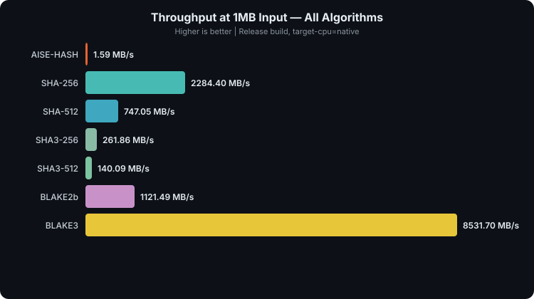
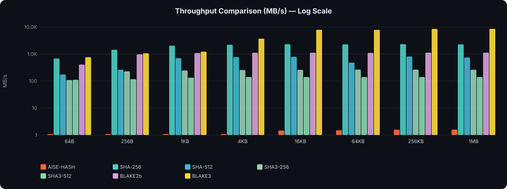
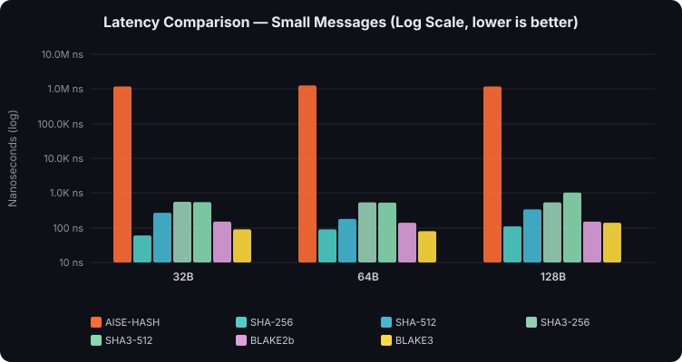
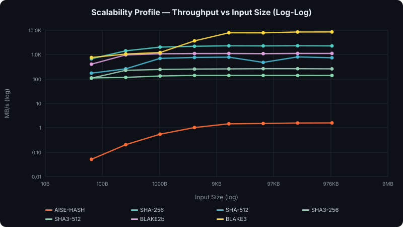
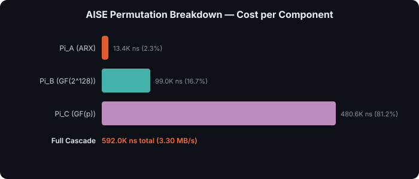

<pre>
   █████╗ ██╗███████╗███████╗      ██████╗ 
  ██╔══██╗██║██╔════╝██╔════╝     ██╔═══██╗
  ███████║██║███████╗█████╗   ██████║   ██║
  ██╔══██║██║╚════██║██╔══╝   ╚════██╗  ██║
  ██║  ██║██║███████║███████╗      ╚██████╔╝
  ╚═╝  ╚═╝╚═╝╚══════╝╚══════╝       ╚═════╝ 

  B E N C H M A R K   R E P O R T
</pre>

# AEGIS-Ω Benchmark Comparison Report

> **Live benchmark results** — not synthetic estimates.  
> All measurements taken on real hardware with optimized release builds.

## System Information

| Property | Value |
|---|---|
| **CPU** | AMD Ryzen 5 7600 6-Core Processor |
| **AVX-512** | ✅ Active (all AISE acceleration paths enabled) |
| **Target** | `target-cpu=native` |
| **Build** | Release (opt-level=3, LTO, codegen-units=1) |
| **Date** | 2026-09-04 00:42:53 +06 |
| **Rust** | rustc 1.96.0 |

## Algorithms Under Test

| Algorithm | Construction | Output | State Size | Key Design Goal |
|---|---|---|---|---|
| **AISE-HASH** | Triple-cascade sponge (Π_A→Π_B→Π_C) | 512-bit | **16,384-bit** | Maximum security margin via algebraic heterogeneity |
| **SHA-256** | Merkle–Damgård | 256-bit | 256-bit | NIST standard, universal compatibility |
| **SHA-512** | Merkle–Damgård | 512-bit | 1,024-bit | 64-bit optimized NIST standard |
| **SHA3-256** | Keccak sponge | 256-bit | 1,600-bit | Post-SHA-2 NIST standard |
| **SHA3-512** | Keccak sponge | 512-bit | 1,600-bit | Wide-output post-SHA-2 standard |
| **BLAKE2b** | HAIFA (ChaCha-derived) | 512-bit | 512-bit | Fast general-purpose hash |
| **BLAKE3** | Bao Merkle tree (ChaCha) | 256-bit | 256-bit | Fastest modern hash, parallelizable |

---

## Throughput — The Big Picture

### Rankings (1MB input)

| Rank | Algorithm | Throughput | Relative to AISE |
|---|---|---|---|
| 🥇 | BLAKE3 | 8531.70 MB/s | 5356x faster |
| 🥈 | SHA-256 | 2284.40 MB/s | 1434x faster |
| 🥉 | BLAKE2b | 1121.49 MB/s | 704x faster |
| #4 | SHA-512 | 747.05 MB/s | 469x faster |
| #5 | SHA3-256 | 261.86 MB/s | 164x faster |
| #6 | SHA3-512 | 140.09 MB/s | 88x faster |
| #7 | **AISE-HASH** | **1.59 MB/s** | 1.00x (baseline) |

---

## Detailed Throughput (MB/s)

| Algorithm | 64B | 256B | 1KB | 4KB | 16KB | 64KB | 256KB | 1MB |
|---|---|---|---|---|---|---|---|---|
| **AISE-HASH** | 0.05 | 0.20 | 0.55 | 1.03 | 1.46 | 1.50 | 1.58 | 1.59 |
| **SHA-256** | 678.17 | 1436.12 | 2034.51 | 2206.92 | 2307.98 | 2283.52 | 2319.73 | 2284.40 |
| **SHA-512** | 174.39 | 262.52 | 702.56 | 765.93 | 788.35 | 480.65 | 808.51 | 747.05 |
| **SHA3-256** | 108.99 | 228.17 | 246.61 | 256.32 | 259.64 | 264.69 | 264.52 | 261.86 |
| **SHA3-512** | 110.97 | 116.81 | 133.23 | 140.72 | 140.74 | 140.39 | 140.84 | 140.09 |
| **BLAKE2b** | 406.90 | 976.56 | 1085.07 | 1112.89 | 1119.27 | 1101.13 | 1120.62 | 1121.49 |
| **BLAKE3** | 762.94 | 1061.48 | 1220.70 | 3685.14 | 7891.41 | 7851.76 | 8503.40 | 8531.70 |

---

## Latency — Small Message Performance

> Small message latency is critical for API authentication, token generation, session IDs.

| Algorithm | 32B median | 32B p99 | 64B median | 64B p99 | 128B median | 128B p99 |
|---|---|---|---|---|---|---|
| **AISE-HASH** | 1.19 ms | 1.38 ms | 1.27 ms | 1.30 ms | 1.19 ms | 1.30 ms |
| **SHA-256** | 0.1 µs | 0.1 µs | 0.1 µs | 0.1 µs | 0.1 µs | 0.1 µs |
| **SHA-512** | 0.3 µs | 0.4 µs | 0.2 µs | 0.3 µs | 0.3 µs | 0.5 µs |
| **SHA3-256** | 0.6 µs | 0.6 µs | 0.5 µs | 0.6 µs | 0.5 µs | 0.7 µs |
| **SHA3-512** | 0.6 µs | 0.6 µs | 0.5 µs | 0.6 µs | 1.0 µs | 1.3 µs |
| **BLAKE2b** | 0.1 µs | 0.2 µs | 0.1 µs | 0.2 µs | 0.1 µs | 0.2 µs |
| **BLAKE3** | 0.1 µs | 0.1 µs | 0.1 µs | 0.1 µs | 0.1 µs | 0.2 µs |

---

## Scalability Profile

> How throughput changes with input size. Algorithms with flatter curves have lower per-block overhead.

---

## AISE Permutation Breakdown

> Where AEGIS-Ω spends its time. The triple-cascade permutation Π_Ω = Π_C ∘ Π_B ∘ Π_A processes the full 16,384-bit state.

| Component | Domain | Time (ns) | Throughput (MB/s) | % of Cascade |
|---|---|---|---|---|
| **Pi_A (ARX)** | ℤ₂₆₄ ARX | 13,430 | 145.43 | 2.3% |
| **Pi_B (GF(2^128))** | GF(2¹²⁸) | 98,960 | 19.74 | 16.7% |
| **Pi_C (GF(p))** | GF(p) Mersenne | 480,591 | 4.06 | 81.2% |
| **Full Cascade (Pi_Omega)** | All three | **591,991** | **3.30** | **100%** |

> [!NOTE]
> **The bottleneck is Π_C (Prime Field)** — modular exponentiation over the Mersenne prime 2¹²⁷−1 is inherently expensive. The alternating power map (x⁵ / x^d) in Rescue-style S-boxes forces high algebraic degree in both directions, which is the core of AISE's security argument but also its performance cost.

---

## Security Analysis

> [!IMPORTANT]
> **Generic security bounds are determined by the output length, not the state size.** For a 512-bit hash output, the birthday bound gives ~2²⁵⁶ collision resistance regardless of internal state width. AISE's 16,384-bit state provides structural margin against *non-generic* attacks (inner collisions, state recovery, capacity-targeting), but does not raise the output-level collision bound.

| Property | AISE-HASH | SHA-256 | SHA-512 | SHA3-256 | SHA3-512 | BLAKE2b | BLAKE3 |
|---|---|---|---|---|---|---|---|
| **Output Size** | 512-bit | 256-bit | 512-bit | 256-bit | 512-bit | 512-bit | 256-bit |
| **Classical Collision** | 2²⁵⁶ † | 2¹²⁸ | 2²⁵⁶ | 2¹²⁸ | 2²⁵⁶ | 2²⁵⁶ | 2¹²⁸ |
| **Quantum Collision (BHT)** | ~2¹⁷¹ † | 2⁸⁵ | ~2¹⁷⁰ | 2⁸⁵ | ~2¹⁷⁰ | ~2¹⁷⁰ | 2⁸⁵ |
| **Classical Preimage** | 2⁵¹² † | 2²⁵⁶ | 2⁵¹² | 2²⁵⁶ | 2⁵¹² | 2⁵¹² | 2²⁵⁶ |
| **Quantum Preimage (Grover)** | 2²⁵⁶ † | 2¹²⁸ | 2²⁵⁶ | 2¹²⁸ | 2²⁵⁶ | 2²⁵⁶ | 2¹²⁸ |
| **Internal State Size** | **16,384-bit** | 256-bit | 1,024-bit | 1,600-bit | 1,600-bit | 512-bit | 256-bit |
| **Capacity (sponge)** | **8,192-bit** | N/A | N/A | 512-bit | 1,024-bit | N/A | N/A |
| **Algebraic Domains** | **3** (ARX + GF(2¹²⁸) + GF(p)) | 1 | 1 | 1 | 1 | 1 | 1 |
| **Permutation Rounds** | **32 × 3** = 96 | 64 | 80 | 24 | 24 | 12 | 7 |

† *Generic bounds assuming ideal permutation behavior. AISE has not undergone independent cryptanalysis — these bounds are theoretical upper limits, not proven security levels.*

> [!NOTE]
> **What the 16,384-bit state actually provides:** In the sponge model, the capacity (8,192 bits for AISE) determines resistance to *structural* attacks — inner-collision attacks, state-recovery attacks, and capacity-targeting attacks. AISE's capacity is 8× larger than SHA3-512's (1,024 bits) and 16× larger than SHA3-256's (512 bits). This is a meaningful structural advantage, but it is distinct from the output-level collision bound.
>
> **Important design note:** Π_Ω is a *surjection*, not a bijection. Each 128-bit lane is reduced to 127 bits via Mersenne reduction before Π_C, causing ~128 bits of information loss per permutation call. This does not break the hash (compression is inherent to hashing), but it means the standard sponge security proof — which assumes a bijective permutation — requires careful adaptation.

---

## When to Use What — Practical Guidance

### 🏆 BLAKE3 — Best for: Raw Speed

- **8532x faster than AISE** at 1MB inputs
- Parallelizable across cores (Merkle tree construction)
- Best choice for: file integrity checking, content-addressable storage, deduplication, CI/CD pipelines
- Limitation: 128-bit collision resistance (256-bit output)

### 🛡️ SHA-256 — Best for: Compatibility & Standards Compliance

- **2284x faster than AISE** at 1MB inputs
- Universal support: TLS, X.509, Bitcoin, HMAC-SHA256
- Best choice for: anything requiring interoperability, digital signatures, certificates
- Limitation: Merkle-Damgård length extension vulnerability (mitigated by HMAC)

### 🔐 SHA-512 — Best for: 64-bit Platform Performance + Higher Security

- **747x faster than AISE** — optimized for 64-bit registers
- 256-bit collision resistance (vs SHA-256's 128-bit)
- Best choice for: Ed25519 signatures, high-security document hashing, certificate transparency

### 🧬 SHA3-256/512 — Best for: Post-SHA-2 Diversity

- Keccak sponge construction — fundamentally different from SHA-2
- No length extension attacks (sponge property)
- Best choice for: defense-in-depth hash diversity, NIST compliance where SHA-3 is mandated
- Note: Slower than SHA-2 on x86 (262x faster than AISE)

### ⚡ BLAKE2b — Best for: Fast 512-bit Hashing

- **1121x faster than AISE** — the fastest 512-bit output hash
- Direct replacement for SHA-512 with better performance
- Best choice for: password hashing (Argon2 internal), key derivation, general-purpose 512-bit digest

### 🔮 AISE-HASH — Best for: Structural Security Margin & Research

- **1.59 MB/s** — deliberately slow due to 16,384-bit state processing
- **3 algebraically independent domains** — an attacker must simultaneously defeat ARX, binary field, and prime field constructions
- **8,192-bit capacity** — the largest sponge capacity of any known hash construction, providing enormous structural margin against non-generic attacks
- **~2²⁵⁶ generic collision resistance** — same output-level bound as SHA-512/SHA3-512/BLAKE2b (all produce 512-bit digests)
- Best choice for:
  - Research baseline for multi-algebraic sponge designs
  - Exploring heterogeneous permutation cascades
  - Scenarios where structural diversity matters more than raw throughput
  - Hashing small secrets (keys, passwords, tokens) where latency is acceptable
- **Not suitable for:** high-throughput data pipelines, real-time file hashing, network protocols
- **Cryptanalysis status:** Unaudited — independent analysis is actively invited (see [SECURITY.md](SECURITY.md))

---

## Conclusion

AEGIS-Ω is **~5356x slower** than BLAKE3 (the fastest algorithm tested) and **~1434x slower** than SHA-256. This is **entirely by design**.

AISE's performance cost buys:
1. **Algebraic heterogeneity**: Three independent mathematical domains (ARX, GF(2¹²⁸), GF(p)) that an attacker must simultaneously defeat
2. **Massive structural margin**: 16,384-bit internal state with 8,192-bit capacity (8× larger than SHA3-512, 16× larger than SHA3-256), providing deep resistance to inner-collision and state-recovery attacks
3. **Rescue-style S-boxes**: Alternating power maps ($x^5$ / $x^d$) that guarantee exponential algebraic degree growth in both forward and backward directions
4. **96 total rounds** across 3 algebraic domains (vs. 24 for SHA3, 7 for BLAKE3)

**What this does NOT buy:** The generic collision resistance of AISE-HASH is ~2²⁵⁶ — identical to SHA-512, SHA3-512, and BLAKE2b — because all produce 512-bit outputs. The large internal state provides *structural* security margin, not a higher output-level collision bound.

The question is: *"does the structural diversity and enormous capacity justify the performance cost for your use case?"* For cryptographic research and exploring multi-algebraic designs, yes. For hashing gigabytes of data, use BLAKE3.

> [!WARNING]
> AEGIS-Ω has **not undergone independent cryptanalysis**. The security claims above assume ideal permutation behavior. Until the design has been subjected to rigorous analysis by independent cryptographers, AISE should be treated as an experimental research construction. See [SECURITY.md](SECURITY.md) for how to contribute cryptanalysis.

---

*Report generated by AEGIS-Ω Benchmark Suite*