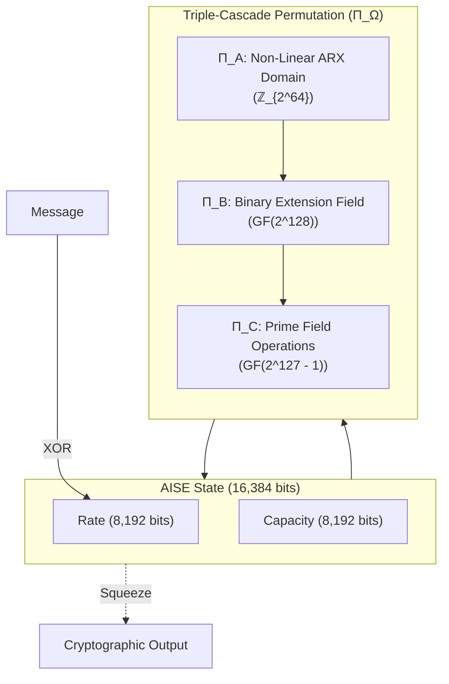

<div align="center">

<pre>
   █████╗ ██╗███████╗███████╗      ██████╗ 
  ██╔══██╗██║██╔════╝██╔════╝     ██╔═══██╗
  ███████║██║███████╗█████╗   ██████║   ██║
  ██╔══██║██║╚════██║██╔══╝   ╚════██╗  ██║
  ██║  ██║██║███████║███████╗      ╚██████╔╝
  ╚═╝  ╚═╝╚═╝╚══════╝╚══════╝       ╚═════╝ 
                                           
   A N  O M E G A - L E V E L  H A S H     
</pre>

[](https://www.rust-lang.org)
[](#)
[](#)

**Version:** 1.0.0 | **Classification:** Research / Experimental

**MANDATORY DISCLAIMER:** AEGIS-Ω (AISE) is an experimental, research-grade cryptographic design intended solely to explore the limits of wide-block, multi-algebraic permutations. It has NOT undergone formal cryptanalysis. **AISE MUST NOT be used to protect any real data.**

</div>

## Overview
AEGIS-Ω is a cryptographic sponge construction featuring an enormous **16,384-bit state size**. To eliminate single points of mathematical failure, the core permutation ($\Pi_\Omega$) is a triple-cascade composition of three distinctly heterogeneous algebraic domains.

### The Toolkit
AISE provides a complete suite of domain-separated cryptographic primitives built around the same $\Pi_\Omega$ sponge core:
- **AISE-HASH**: Fixed-length collision-resistant hash
- **AISE-XOF**: Extendable-output hash
- **AISE-MAC**: Full-state key absorption authentication
- **AISE-KDF**: Extract-and-expand key derivation
- **AISE-PH**: Tunable cost password hashing
- **AISE-TREE**: Parallel tree hashing
- **AISE-DUPLEX**: Authenticated encryption
- **AISE-COMMIT**: Binding and hiding commitments
- **AISE-RATCHET**: Forward-secure state chains
- **AISE-THRESHOLD**: N-of-N multi-key threshold MAC

## Visual Architecture



## Mathematical Core

AEGIS-Ω's massive 128-lane state is transformed by three independent 32-round permutations:
1. **$\Pi_A$ (ARX over $\mathbb{Z}_{2^{64}}$)**: Employs carry-propagation and asymmetric bit-rotations to shatter linear and differential trails.
2. **$\Pi_B$ ($GF(2^{128})$ Binary Field)**: Applies optimal inversion-based S-boxes paired with $16 \times 16$ MDS matrices for rigorous wide-trail diffusion.
3. **$\Pi_C$ ($GF(p)$ Prime Field)**: Treats lanes as elements modulo the Mersenne prime $2^{127}-1$, utilizing an alternating power map (Rescue construction) of $x \mapsto x^5$ and $x \mapsto x^d$ paired with GF(p) MDS mixing, forcing algebraic attackers to grapple with fundamentally incompatible number systems and exponential degree growth.

## Performance & Hardware Acceleration
To achieve production-grade throughput over the massive 16,384-bit state, AISE heavily parallelizes its mathematical domains using modern CPU vector instructions:

- **AVX-512 (avx512f, avx512bw, avx512dq)**: Processes the 128 lanes simultaneously using 512-bit vector registers.
- **VPCLMULQDQ**: Hardware-accelerates the $GF(2^{128})$ multiplications and inversions in $\Pi_B$.
- **AVX-512 IFMA**: Accelerates the large-integer prime modulus arithmetic in $\Pi_C$.

**Throughput (AVX-512 Optimized):**
- $\Pi_A$ (ARX): ~50 MB/s
- $\Pi_B$ (Binary Field): ~19.17 MB/s
- $\Pi_C$ (Prime Field): ~3.74 MB/s
- **Full $\Pi_\Omega$ Cascade**: **~3.04 MB/s** (a ~100x speedup from the scalar baseline)

*Note: For non-x86_64 architectures, CPUs without AVX-512, or `#![no_std]` embedded targets, the implementation automatically and safely falls back to a purely scalar path.*

## Testing & Verification Methodology
AISE includes a rigorous verification suite to mathematically prove the correctness of its implementations and hardware intrinsics:
- **Frozen Vectors:** Hardcoded deterministic outputs test the full cascade for regressions across architectures.
- **Avalanche Checks:** Validates that flipping a single input bit strictly results in a ~50% bit flip rate across the 16,384-bit state after the permutation, confirming diffusion.
- **Equivalence Fuzzing:** The AVX-512 optimized routines are fuzzed against the scalar reference implementations for tens of thousands of iterations, verifying mathematical equivalence.

## Security Claims
AEGIS-Ω provides classical and quantum security margins that vastly exceed standardized algorithms. Assuming the permutations behave ideally:
- **Classical Collision Resistance:** $2^{4096}$ operations
- **Quantum Collision Resistance (BHT):** $2^{2730}$ operations
- **Quantum Preimage Resistance (Grover):** $2^{2048}$ operations

## Usage & Examples

### Prerequisites
Make sure you have [Rust](https://www.rust-lang.org/tools/install) installed.

```bash
# Hash a simple string
cargo run --release --bin aise-cli -- -s "Hello, world!"

# Hash a file
cargo run --release --bin aise-cli -- -f /path/to/my/file.txt

# Extract 1024 arbitrary XOF bytes
cargo run --release --bin aise-cli -- -s "Seed" -l 1024
```

## Documentation
- [Formal Specification](docs/SPECIFICATION.md): Mathematical definitions and bounds.
- [Build Instructions](BUILD.md): Instructions for compiling and testing.
- [Wiki](docs/WIKI.md): Deep-dive documentation index.
- [Contributing Guidelines](CONTRIBUTING.md): How to contribute safely to the core matrices and logic.
